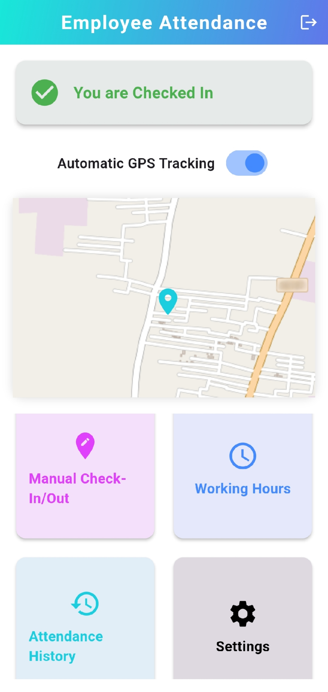
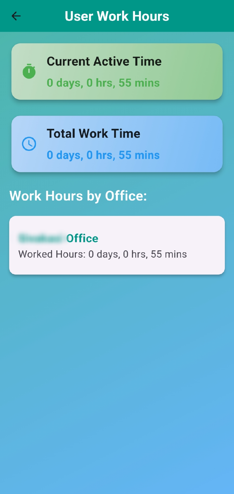

# Geolocation-Based Attendance Management System

A Flutter-based mobile application for tracking attendance using geolocation. This application leverages location services and Firebase backend to verify and log users' attendance at designated locations, ideal for organizations and institutions that require a reliable, location-based check-in/check-out system.

## Screenshots

| **Login**              | **Signup**           | **Home (Auto Check-in)**  | **Home**              | **Manual Check-in/Out** | **Total Work Hours**     | **Attendance History**   |
|------------------------|----------------------|---------------------------|-----------------------|-------------------------|--------------------------|--------------------------|
|   |   |  |   |  |  |   |


## Features
- **Login & Sign-up**: Secure user authentication using Firebase Authentication
- **Cloud Storage**: Real-time attendance data synchronization using Firebase Realtime Database
- **Geolocation Check-In/Check-Out**: Automatically records attendance when users enter or exit designated areas
- **Manual Check-In Option**: Allows users to log attendance manually if geolocation fails
- **Attendance History**: View and track past attendance records in an organized format
- **Working Hours Calculation**: Calculates total hours worked based on check-in and check-out times
- **User Dashboard**: Personalized homepage displaying attendance status, work hours, and quick access to key features

## Screens
1. **Login Page**: User authentication screen
2. **Sign-Up Page**: New user registration
3. **Home Page**: Dashboard with quick access to attendance features
4. **Attendance History**: View past attendance records
5. **Manual Check-In**: For manual attendance in case of location service issues
6. **Working Hours Page**: Displays total hours worked
7. **Work Hours Tracking**: Logs check-in/check-out times to calculate work duration

## Prerequisites
- Flutter SDK
- Dart SDK
- Firebase Account
- Android Studio / VS Code
- Git

## Firebase Setup
1. Create a new Firebase project at [Firebase Console](https://console.firebase.google.com/)
2. Enable Authentication and Realtime Database in your Firebase project
3. Download the `google-services.json` file:
   - Go to Project Settings > Your Apps
   - Click on Android icon (add Android app)
   - Register app with your package name (found in android/app/build.gradle)
   - Download the `google-services.json` file
4. Place the `google-services.json` file in the `android/app/` directory
   > ⚠️ Note: The `google-services.json` file contains sensitive API keys and should not be committed to version control. Make sure it's listed in your `.gitignore` file.

## Installation
1. Clone this repository
```bash
git clone https://github.com/yourusername/geolocation-attendance.git
```

2. Ensure Flutter and Dart SDKs are installed

3. Set up Firebase configuration:
   - Add your `google-services.json` file to `android/app/`
   - Configure Firebase in your Flutter app:
```dart
// Add these dependencies to pubspec.yaml
dependencies:
  firebase_core: ^latest_version
  firebase_auth: ^latest_version
  cloud_firestore: ^latest_version
```

4. Install dependencies
```bash
flutter pub get
```

5. Run the app on a connected device or emulator
```bash
flutter run
```

## Usage
- Register as a new user or log in with existing credentials
- Allow location access for geolocation-based check-ins
- Use the dashboard to track attendance, check working hours, and view attendance history

## Future Enhancements
- **Admin Dashboard**: Interface for administrators to view all users' attendance
- **Push Notifications**: Reminders for check-in/check-out
- **Offline Mode**: Record attendance even without internet, sync when online
- **Settings**: Settings Page in the User Dashboard to customize the preferences

## Firebase Security
- Ensure you have proper security rules set up in your Firebase Console
- Never expose API keys or sensitive credentials in public repositories
- Regularly rotate Firebase API keys
- Implement proper user authentication checks


